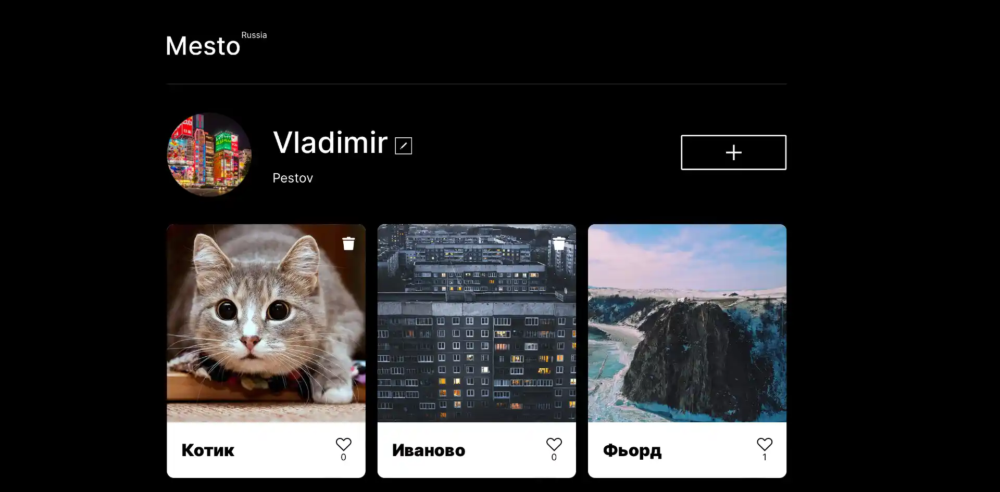

# Учебный проект: Место

### Описание
Это интерактивная страница, где люди делятся фотографиями их любимых мест. А также оценивают фотографии других пользователей.
#### Демонстрация приложения: [https://pestov-web.github.io/mesto](https://pestov-web.github.io/mesto)
### Стек приложения

#### Дополнительно:
- Flexbox
- Grid-layout
- Файловая и CSS структура по БЭМ.
- Адаптивная верстка
- Подход mobile-first
- ООП
- Работа с fetch API

## Работа с приложением

### в директории приложения можно использовать команды:

#### устанока необходимых пакетов для работы
#### `npm i`

#### запуск приложения в режиме разработки, необходимо перейти по ссылке  [http://localhost:8080](http://localhost:8080) для просмотра
#### `npm run dev`

#### Собирает приложения для размещения в папку `build`.
#### `npm run build`
